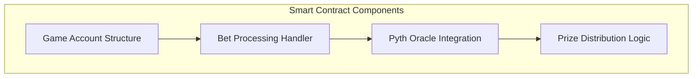
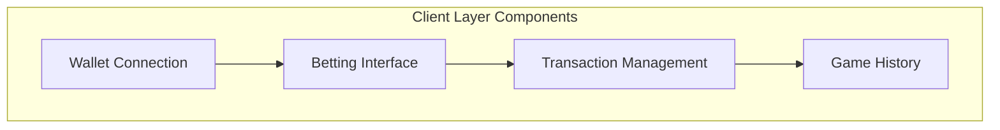
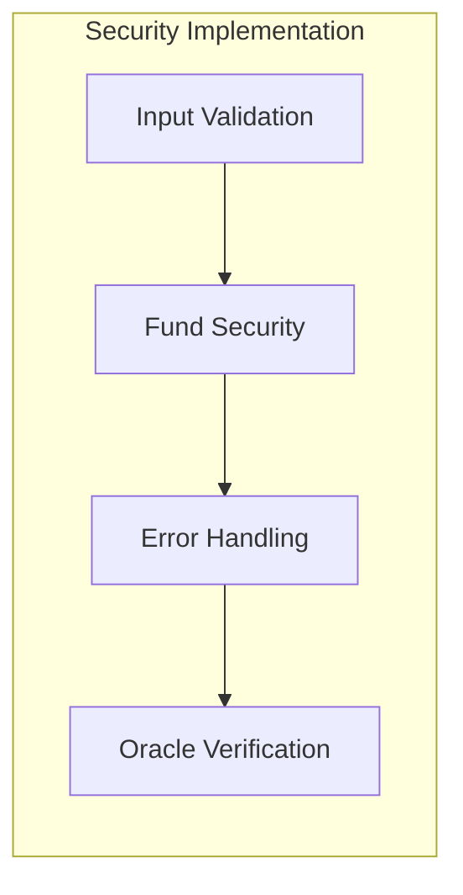

# Solana Coin Flip Game System Patterns

## System Architecture

### 1. Smart Contract Layer (Rust/Anchor)

#### Components
- **Game Account Structure**
  - Stores game state
  - Tracks bet amount
  - Records user choice (heads/tails)
  - Maintains game outcome
  - Tracks winner status

- **Bet Processing Handler**
  - Manages bet placement
  - Handles SOL transfers to escrow
  - Updates game state
  - Validates transactions

- **Pyth Oracle Integration**
  - Fetches verifiable random numbers
  - Ensures fair outcome generation
  - Manages oracle data consistency

- **Prize Distribution Logic**
  - Handles winner determination
  - Manages SOL transfers
  - Updates account balances
  - Ensures secure payouts

### 2. Client Architecture (Next.js/TypeScript)

#### Components
- **Wallet Connection**
  - @solana/wallet-adapter integration
  - Phantom Wallet optimization
  - Auto-connect functionality
  - Balance monitoring

- **Betting Interface**
  - Heads/tails selection
  - Bet amount input
  - Transaction initiation
  - Game status display

- **Transaction Management**
  - @solana/web3.js integration
  - Transaction construction
  - Signature handling
  - Confirmation tracking

- **Game History**
  - Transaction records
  - Outcome tracking
  - Balance updates
  - Performance metrics

## Key Technical Decisions

### 1. Blockchain Infrastructure
- **Network**: Solana Mainnet/Devnet
- **Framework**: Anchor for smart contract development
- **Language**: Rust for contract, TypeScript for client
- **State Management**: Program Derived Accounts (PDAs)

### 2. Frontend Architecture
- **Framework**: Next.js with TypeScript
- **Wallet Integration**: @solana/wallet-adapter
- **State Management**: React hooks
- **Network Interface**: @solana/web3.js

### 3. Oracle Implementation
- **Provider**: Pyth Network
- **Purpose**: Verifiable random number generation
- **Integration**: Direct smart contract integration
- **Fallback**: System-based randomness backup

### 4. Security Patterns

- **Fund Security**
  - Escrow account implementation
  - Atomic transactions
  - Balance verification
  - Authorized withdrawals

- **Input Validation**
  - Bet amount validation
  - Address verification
  - Balance checks
  - Transaction limits

- **Error Handling**
  - Transaction retry logic
  - Oracle fallback
  - User feedback
  - State recovery

### 5. Performance Optimization
- **Transaction Efficiency**
  - Minimal state updates
  - Optimized instruction layout
  - Efficient account structure

- **Frontend Performance**
  - Static generation where possible
  - Optimized wallet connection
  - Efficient state updates
  - Minimal rerendering

### 6. Testing Strategy
- **Smart Contract Testing**
  - Unit tests for contract logic
  - Integration tests with oracle
  - Security vulnerability tests
  - Performance benchmarks

- **Frontend Testing**
  - Component unit tests
  - Integration testing
  - Wallet interaction tests
  - End-to-end testing

## Design Patterns

### 1. Account Management
- PDA derivation for game accounts
- Clear account ownership model
- Efficient account lookup
- Minimal account creation

### 2. State Management
- Atomic state updates
- Clear state transitions
- Predictable game flow
- Efficient data storage

### 3. Error Management
- Comprehensive error types
- Clear error messages
- Recovery procedures
- User feedback system

### 4. Component Relationships
- Clear separation of concerns
- Modular component design
- Reusable utilities
- Consistent interfaces
