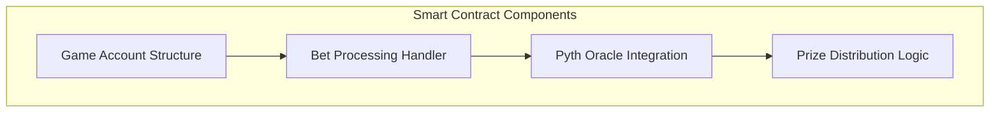

# Solana Coin Flip Game System Patterns

## System Architecture

### 1. Smart Contract Layer (Rust/Anchor)

```mermaid
flowchart TB
    subgraph SmartContract[Smart Contract Components]
        GameAccount[Game Account Structure]
        BetHandler[Bet Processing Handler]
        PythOracle[Pyth Oracle Integration]
        PrizeLogic[Prize Distribution Logic]
    end

    GameAccount --> BetHandler
    BetHandler --> PythOracle
    PythOracle --> PrizeLogic
```

[Rest of systemPatterns content...]